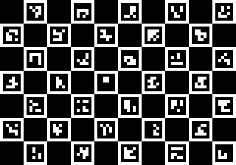

# calibcam

<p align="center">
  <a href="https://pypi.org/project/bbo-calibcam/"></a>
  <a href="https://pypi.org/project/bbo-calibcam/"></a>
</p>

*A command line tool for charuco-based calibration of multi-camera setups (intrinsic and extrinsic parameters), including omnidirectional cameras.*

[OpenCV](https://opencv.org/), the popular computer vision library, provides tools for camera calibration, but they are not designed for multi-camera setups. calibcam fills this gap by providing a pipeline for multi-camera calibration.

Multi-camera calibration in calibcam works as follows: 
> First, OpenCV is used for single camera calibration, followed by an initial estimation of camera positions and orientations. Subsequently, all intrinsic and extrinsic parameters are optimised for reprojection error using [Jax](https://github.com/google/jax) autograd.

Major features:
- Allows calibration of **camera setups consisting of multiple lens** types ex: a combination of omnidirectional and pinhole cameras.
- **Flexibility** to fix or optimize individual intrinsic and extrinsic parameters as needed, allowing users to leverage prior knowledge or constraints about their camera setup.
- **Modular pipeline** allows users to perform individual steps of the calibration process, such as detection, single camera calibration, and multi-camera calibration.
- **Direct video support** (.mp4 or .ccv) for calibration data input, given the videos are synchronised or have a constant frame offset.
- Generates plots in the output for **visualisation of the calibration result**, including spread of detections across cameras and reprojection error.


Note: See [calibcamlib](https://github.com/bbo-lab/calibcamlib) for a library for triangualtion, reprojection etc.

## Board and data collection
calibcam uses Charuco boards for calibration (example board image below). See `tools/board.py` for the generation of both printable PNG and board configuration file for calibcam.



The board needs to be presented in different angles, positions and distances to each camera (important for accurate single camera calibration). Relative camera positions are estimated from frames in which the board is visible in multiple cameras. We recommend recording with 2 fps while moving the board around, spending around a minute on each camera.


## Installation

Install bbo-calibcam via pip
```bash
pip install bbo-calibcam
```
or create conda environment from environment.yml:
```bash
conda env create -f https://raw.githubusercontent.com/bbo-lab/calibcam/main/environment.yml
```


## Usage

1. Collect data as described in Board section. 
2. Run calibcam with: 
```bash
python -m calibcam --videos [LIST OF VIDEOS TO INCLUDE] --board [PATH TO BOARD.NPY file]
``` 
We recommend keeping a copy of the board file with the videos for documentation purposes.

3. Check number of detections per camera in the output. Values should range between 80 and 300. If too few detections are made, check recording conditions (lighting, blur ...) and collect new calibration data. If too many frames are detected, convergence may be slow or run out of memory. Reduce detections adding a frame skip with `--frame_step`.
4. Check reprojection error at the end of the output. Median errors should be <0.5px.

## Format
### Result
Generated `multicam_calibration.npy/mat/yml` holds a dictionary/struct with the calibration results. The filed `"calibs"` holds an array of calibration dictionarys/structs with entries
```
* 'rvec_cam': (3,) - Rotation vector of the respective cam (world->cam)
* 'tvec_cam': (3,) - Translation vector of the respective cam (world->cam)
* 'A': (3,3) - Camera matrix
* 'k': (5,) - Camera distortion coefficients
```
For further structure, refer to `camcalibrator.build_result()`

### BBO internal MATLAB use only:
Use MATLAB function `mcl = cameralib.helper.mcl_from_calibcam([PATH TO MAT FILE OUTPUT OF CALIBRATION])` from bboanlysis_m to generate an MCL file.
